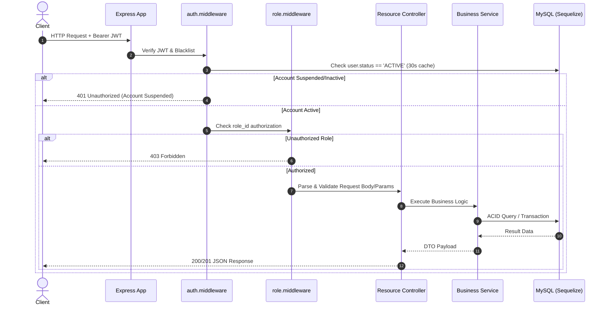
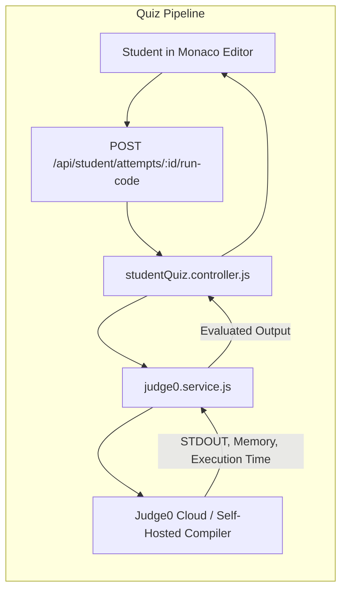

# NSI IT LMS — System Architecture Document

This document outlines the technical architecture, design patterns, component hierarchy, security protocols, and operational workflows of the **NSI IT Learning Management System**.

---

## 1. Architectural Overview

NSI-IT-LMS follows a decoupled, three-tier architecture:

```mermaid
flowchart TD
    subgraph Client Tier [Frontend Client (React 19 + Vite)]
        SPA[React 19 Single Page App]
        Router[React Router v7 Route Guards]
        Context[Auth, Student, Instructor Contexts]
        Services[Axios / Fetch API Client Services]
    end

    subgraph API Tier [Backend REST API (Node.js + Express 5)]
        ExpressApp[Express 5 Application]
        Security[Helmet, CORS, Rate Limit, Compression]
        AuthMid[Auth & Role-Based Middleware]
        Controllers[Resource Controllers]
        BizServices[Business Logic & Report Aggregation]
        Judge0[Judge0 Code Execution Client]
    end

    subgraph Persistence Tier [Data & Storage]
        Sequelize[Sequelize 6.37 ORM]
        MySQL[(MySQL 8.0 Engine utf8mb4)]
        DiskStorage[Uploads Folder / Binary Blobs]
    end

    SPA --> Router
    Router --> Context
    Context --> Services
    Services -- "HTTP / JSON (Bearer JWT)" --> Security
    Security --> AuthMid
    AuthMid --> Controllers
    Controllers --> BizServices
    BizServices --> Judge0
    BizServices --> Sequelize
    Sequelize --> MySQL
    BizServices --> DiskStorage
```

---

## 2. Frontend Architecture (`client/`)

The frontend is built with **React 19.2** and **Vite 8.2**, leveraging modern component compositions and hook-driven state management.

### 2.1 Route Guarding & Layout Composition
Navigation is governed by [client/src/App.jsx](file:///c:/Users/91876/Desktop/Nitashree_lms/NSI-IT-LMS/client/src/App.jsx) and [client/src/components/common/ProtectedRoute.jsx](file:///c:/Users/91876/Desktop/Nitashree_lms/NSI-IT-LMS/client/src/components/common/ProtectedRoute.jsx):

* **Unauthenticated Access:** Requests to protected routes redirect immediately to `/login`.
* **Role-Based Portal Routing:**
  * `ADMIN` users default to `/admin/dashboard` inside `AdminLayout`.
  * `INSTRUCTOR` users default to `/instructor` inside `InstructorLayout`.
  * `STUDENT` users default to `/student` inside `StudentLayout`.
* **Administrative Proxy Viewing (Dual-Context):**
  * Admins can inspect the exact view of any instructor via `/admin/instructors/:id/portal` using `AdminInstructorPortalWrapper`.
  * Admins can inspect the exact view of any student via `/admin/students/:id/portal` using `AdminStudentPortalWrapper`.
  * API requests sent from these proxy wrappers attach `x-instructor-id` or `x-student-id` headers, allowing the backend to emulate their perspective while maintaining administrative audit integrity.

### 2.2 Global State Management
* **`AuthContext`:** Manages active JWT tokens in `localStorage`, decodes user claims, enforces expiration timeouts, and handles sign-out blacklisting.
* **`StudentPortalContext` / `InstructorPortalContext`:** Provides active batch selections, enrolled course cache, and timetable synchronizations across portal views.

---

## 3. Backend Architecture (`server/`)

The backend is built on **Express 5.2.1** with modern async route handling and centralized error catching.

### 3.1 Request Pipeline & Middleware Chain



### 3.2 Security Architecture
1. **Password Hashing:** All user passwords are encrypted using `bcryptjs` with 10 salt rounds. Plaintext passwords never enter logs or database tables.
2. **JWT Lifecycle:** Tokens are signed with HMAC-SHA256 containing `id`, `username`, and `role_id` with a 24-hour expiration (`1d`).
3. **Real-time Status Revocation:** In addition to cryptographic signature validation, [auth.middleware.js](file:///c:/Users/91876/Desktop/Nitashree_lms/NSI-IT-LMS/server/src/middleware/auth.middleware.js) verifies that the user is currently `ACTIVE` in MySQL. Suspended accounts are immediately rejected without waiting for token expiry.
4. **Device Authorization:** Students are bound by concurrent device limits tracked in the `user_devices` table. Admins have revocation power over unauthorized machines.

---

## 4. Assessment Engine & Judge0 Integration

The quiz and programming assessment engine is structured to support both multiple-choice and live algorithmic code execution:



* **Supported Compilers:** Python 3, JavaScript (Node.js), Java, C++, C, and Bash.
* **Security Isolation:** Code execution does not take place on the LMS API server; it is sandboxed through Judge0 containers with memory and CPU time thresholds.

---

## 5. Reporting & Analytics Architecture

The **Reports Hub** aggregates operational data across 5 distinct domains:
1. **Enrollments & Progress:** Joins `users`, `batch_students`, `batches`, `courses`, and `course_progress` to calculate completion metrics.
2. **Assessments:** Calculates passing percentages, average scores, and attempt frequencies from `quizzes` and `quiz_attempts`.
3. **Batches & Schedules:** Tracks upcoming vs completed cohorts and timetable density.
4. **Course Reviews:** Computes satisfaction score distributions and sentiment comments from `course_reviews`.
5. **360° Student Dossier:** Combines user identity, batch history, session lecture views, assessment grades, and device audit logs into an individual student report downloadable as CSV.
