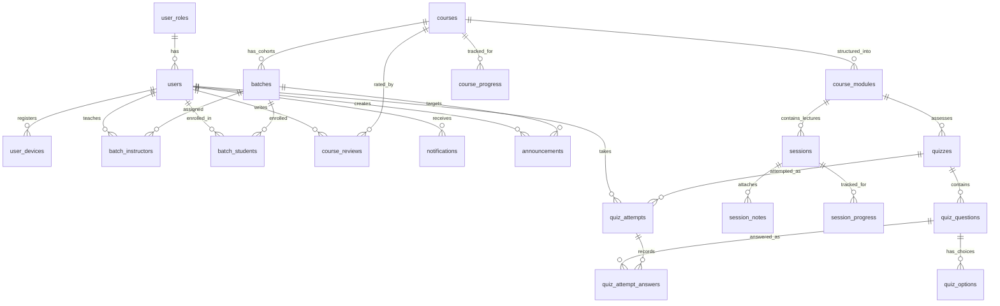

# NSI IT LMS — Database Schema & Data Dictionary

This document provides complete documentation of the **MySQL 8.0** relational database architecture for NSI IT LMS.

---

## 1. Entity-Relationship Diagram (ERD)



---

## 2. Table Specifications & Data Dictionary

The database consists of **22 active application tables** defined in `database/migrations/` and modeled in `server/src/models/`.

### 2.1 `user_roles`
Lookup table defining authorization roles.
* **Columns:**
  * `id` (INT UNSIGNED, PK, Auto Increment)
  * `name` (VARCHAR(100), UNIQUE, NOT NULL): `'ADMIN'`, `'INSTRUCTOR'`, `'STUDENT'`
  * `created_at`, `updated_at`, `created_by`, `updated_by`

---

### 2.2 `users`
Core user account identity.
* **Columns:**
  * `id` (INT UNSIGNED, PK, Auto Increment)
  * `first_name` (VARCHAR(100), NOT NULL)
  * `last_name` (VARCHAR(100), NOT NULL)
  * `email` (VARCHAR(150), UNIQUE, NOT NULL)
  * `username` (VARCHAR(100), UNIQUE, STORED GENERATED):
    `CONCAT(LOWER(REPLACE(first_name, ' ', '')), '.', LOWER(REPLACE(last_name, ' ', '')), '@nsi')`
  * `password` (VARCHAR(255), NOT NULL): bcrypt hash
  * `role_id` (INT UNSIGNED, FK -> `user_roles.id`)
  * `status` (ENUM('ACTIVE','INACTIVE','SUSPENDED'), DEFAULT 'ACTIVE')
  * `contact_no` (VARCHAR(20), NOT NULL)
  * `gender` (ENUM('MALE','FEMALE','OTHER'), NOT NULL)
  * `date_of_birth` (DATE, Nullable)
  * `photo` (VARCHAR(500) / MEDIUMBLOB, Nullable)

---

### 2.3 `user_devices`
Tracks device bindings and enforces concurrent student login policies.
* **Columns:**
  * `id` (INT UNSIGNED, PK)
  * `user_id` (INT UNSIGNED, FK -> `users.id` ON DELETE CASCADE)
  * `device_id` (VARCHAR(255), NOT NULL)
  * `device_name` (VARCHAR(150), Nullable)
  * `device_type` (ENUM('DESKTOP','LAPTOP','MOBILE','TABLET'))
  * `browser` (VARCHAR(100))
  * `operating_system` (VARCHAR(100))
  * `last_ip_address` (VARCHAR(45))
  * `last_login_at` (TIMESTAMP)
  * `status` (ENUM('ACTIVE','REVOKED'), DEFAULT 'ACTIVE')
* **Indexes:** `UNIQUE KEY uk_user_device (user_id, device_id)`

---

### 2.4 `courses`
Course catalog definition.
* **Columns:**
  * `id` (INT UNSIGNED, PK)
  * `code` (VARCHAR(30), UNIQUE, NOT NULL): e.g. `'FS-MERN'`
  * `name` (VARCHAR(200), NOT NULL)
  * `description` (TEXT, Nullable)
  * `thumbnail_url` (VARCHAR(500), Nullable)
  * `duration` (VARCHAR(20), Nullable): e.g. `'6 Months'`
  * `status` (ENUM('DRAFT','ACTIVE','INACTIVE','ARCHIVED'), DEFAULT 'DRAFT')

---

### 2.5 `batches`
Cohort schedules linked to courses.
* **Columns:**
  * `id` (INT UNSIGNED, PK)
  * `name` (VARCHAR(100), NOT NULL)
  * `course_id` (INT UNSIGNED, FK -> `courses.id`)
  * `batch_code` (VARCHAR(100), UNIQUE, STORED GENERATED): `CONCAT(name, '-', UPPER(DATE_FORMAT(start_date, '%b')), '-', DATE_FORMAT(start_date, '%Y'))`
  * `start_date` (DATE, NOT NULL)
  * `end_date` (DATE, Nullable)
  * `batch_mode` (ENUM('ONLINE','OFFLINE','HYBRID'), DEFAULT 'ONLINE')
  * `batch_time` (ENUM('MORNING','EVENING'), DEFAULT 'MORNING')
  * `batch_schedule` (ENUM('WEEKDAYS','WEEKENDS'), DEFAULT 'WEEKDAYS')
  * `status` (ENUM('UPCOMING','ACTIVE','COMPLETED','CANCELLED'), DEFAULT 'UPCOMING')

---

### 2.6 `batch_instructors` & `batch_students`
Many-to-many relationship tables connecting cohort batches with faculty and learners.
* `batch_instructors`: `UNIQUE KEY (batch_id, instructor_id)`, FKs to `batches.id` and `users.id`.
* `batch_students`: `UNIQUE KEY (batch_id, student_id)`, `enrollment_date`, `status` (`'ACTIVE'`,`'INACTIVE'`,`'COMPLETED'`,`'DROPPED'`).

---

### 2.7 `course_modules`
Curriculum syllabus units within a course.
* **Columns:** `id`, `course_id` (FK), `name`, `description`, `display_order`, `duration`, `status` (`ACTIVE`,`INACTIVE`).
* **Indexes:** `UNIQUE KEY uk_course_module (course_id, name)`.

---

### 2.8 `sessions` (Lectures) & `session_notes`
Lecture units belonging to modules.
* **`sessions`:** `id`, `module_id` (FK), `instructor_id` (FK), `title`, `description`, `session_type` (`LIVE`,`RECORDED`), `status` (`DRAFT`,`SCHEDULED`,`LIVE`,`COMPLETED`,`CANCELLED`,`PUBLISHED`), `session_url` (Meeting URL), `recording_url`, `duration_minutes`.
* **`session_notes`:** `id`, `session_id` (FK), `title`, `note_type` (`PDF`,`PPT`,`DOC`,`EXCEL`,`ZIP`,`CODE`,`LINK`,`OTHER`), `file_url`, `external_url`.

---

### 2.9 Quizzes & Assessment Engine
* **`quizzes`:** `id`, `course_id` (FK), `module_id` (FK), `session_id` (FK, Nullable), `title`, `duration_minutes`, `total_marks`, `passing_marks`, `max_attempts`, `status` (`DRAFT`,`PUBLISHED`,`CLOSED`,`CANCELLED`).
* **`quiz_questions`:** `id`, `quiz_id` (FK), `question_type` (`MCQ`,`CODING`), `question_text`, `marks`, `display_order`, `difficulty` (`EASY`,`MEDIUM`,`HARD`), `programming_language`, `starter_code`, `expected_output`, `constraints`.
* **`quiz_options`:** `id`, `question_id` (FK), `option_label` (`'A'`, `'B'`), `option_text`, `is_correct` (BOOLEAN).
* **`quiz_attempts`:** `id`, `quiz_id` (FK), `student_id` (FK), `attempt_number`, `status` (`IN_PROGRESS`,`SUBMITTED`,`AUTO_SUBMITTED`,`CANCELLED`), `score`, `total_marks`, `passed` (BOOLEAN), `started_at`, `submitted_at`.
  * `UNIQUE KEY uk_quiz_student_attempt (quiz_id, student_id, attempt_number)`.
* **`quiz_attempt_answers`:** `id`, `attempt_id` (FK), `question_id` (FK), `selected_option_id` (FK), `code_submission`, `is_correct`, `marks_awarded`.

---

### 2.10 Progress Tracking
* **`session_progress`:** `session_id` (FK), `student_id` (FK), `completed` (TINYINT(1)), `completed_at`.
  * `UNIQUE KEY uk_session_student_progress (session_id, student_id)`.
* **`course_progress`:** `course_id` (FK), `student_id` (FK), `completion_percentage`, `completed_sessions`, `total_sessions`, `completed` (BOOLEAN).
  * `UNIQUE KEY uk_course_student_progress (course_id, student_id)`.

---

### 2.11 Reviews, Communications & Settings
* **`course_reviews`:** `course_id` (FK), `student_id` (FK), `rating` (1-5), `review` (TEXT), `status` (`ACTIVE`,`HIDDEN`).
* **`announcements`:** `title`, `message`, `course_id` (Nullable), `batch_id` (Nullable), `status` (`DRAFT`,`PUBLISHED`,`ARCHIVED`).
* **`notifications`:** `user_id` (FK), `title`, `message`, `notification_type`, `is_read` (BOOLEAN), `read_at`.
* **`settings`:** `setting_key` (VARCHAR(100), UNIQUE), `setting_value` (TEXT), `category` (`GENERAL`,`ACADEMIC`,`SECURITY`,`NOTIFICATION`), `description`.

---

## 3. Database Migration Procedures

All migrations are located in `database/migrations/` and managed idempotently by:
```bash
node server/src/scripts/run_migrations.js
```
The script runs the complete table drop sequence (handling strict foreign key order) and applies scripts `001_*.sql` through `023_*.sql`, followed by default seed data for user roles and administrator credentials.
